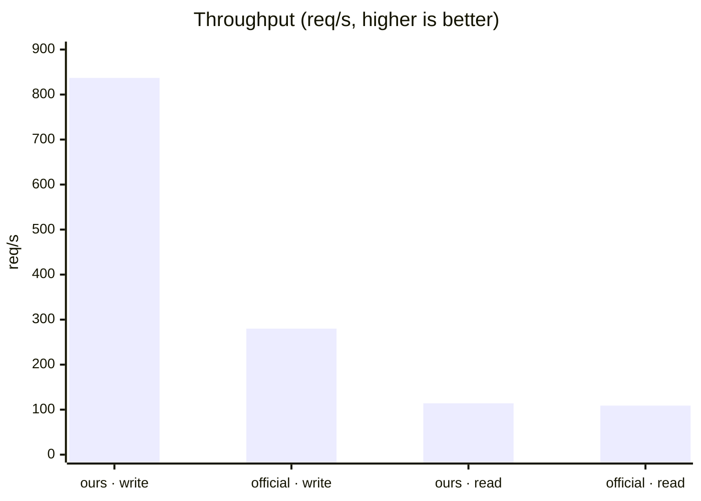
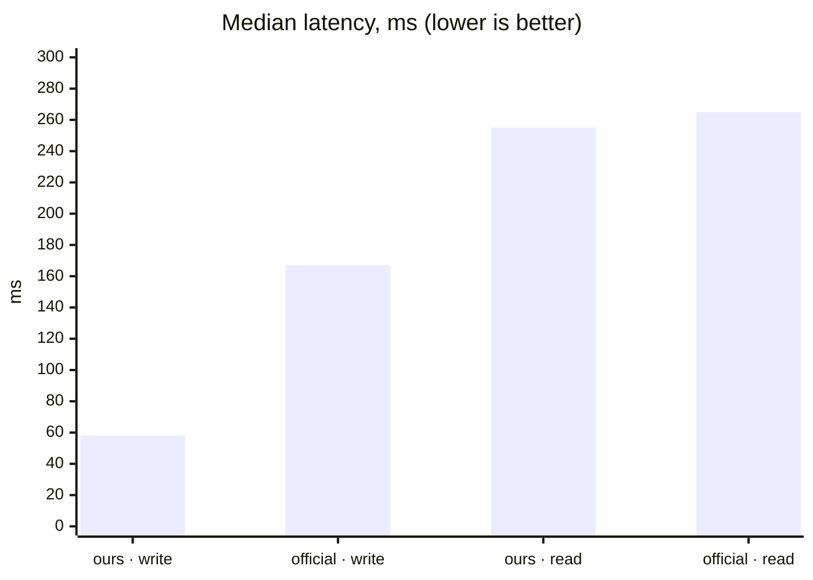
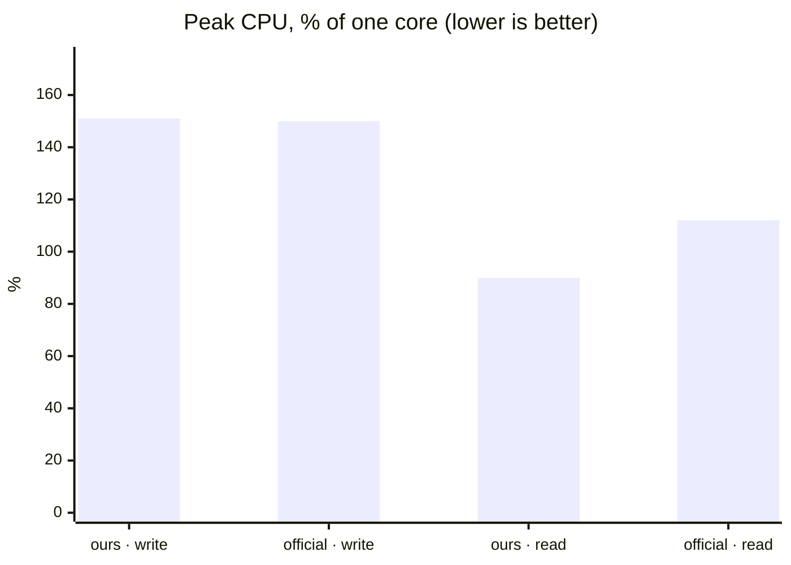

# Elysia with Bun runtime

## Getting Started
To get started with this template, simply paste this command into your terminal:
```bash
bun create elysia ./elysia-example
```

## Development
To start the development server run:
```bash
bun run dev
```

Open http://localhost:3000/ with your browser to see the result.

<!-- BENCHMARK:START -->
## Benchmark

`umami-back-lite` (Elysia on Bun) vs. the official `ghcr.io/umami-software/umami:postgresql-latest`
image, both pointed at one shared Postgres instance with identical schema and
seed data. Measured 2026-09-03 —
reproduce with `docker compose up -d --build`, then
`RATE_LIMIT_MAX=1000000 docker compose up -d app` (raw write capacity — see
caveats),
`bun scripts/bench.ts ours http://localhost:3000 <app-container>`,
`docker compose up -d app` (restore the default limit), then
`bun scripts/bench.ts official http://localhost:3001 <umami-container>`,
and regenerate this section with `bun scripts/bench-report.ts`.








| Metric | umami-back-lite | official umami | difference |
|---|---:|---:|---:|
| Write — req/s | **837.3** | 279.6 | 2.99× |
| Write — p50 / p95 / p99 (ms) | **58 / 75 / 88** | 167 / 235 / 257 | 2.88× faster |
| Write — peak mem (MiB) | **239.3** | 601.9 | 60.2% less |
| Write — peak CPU (%) | **151.1** | 149.6 | 1% more |
| Read — req/s | **114.1** | 108.6 | 1.05× |
| Read — p50 / p95 / p99 (ms) | **255 / 315 / 341** | 265 / 310 / 358 | 1.04× faster |
| Read — peak mem (MiB) | **230.5** | 710.6 | 67.6% less |
| Read — peak CPU (%) | **89.9** | 111.8 | 19.5% less |
| Idle memory (MiB) | **134.5** | 264.4 | 49.1% less |

**Caveats:** both backends ran as sibling containers on one Docker host, so
absolute numbers are host-specific — the side-by-side comparison is the
meaningful part. Our rate limiter (`RATE_LIMIT_MAX`, 300 req/10s per IP by
default) was raised via env var during the write-path test to measure raw
capacity (a single-IP load generator would otherwise hit it almost
immediately); it ships enabled at the 300 default. Traffic came from one
synthetic IP/session, so the read path was measured against a small, uniform
dataset, not high-cardinality data at scale.
<!-- BENCHMARK:END -->
